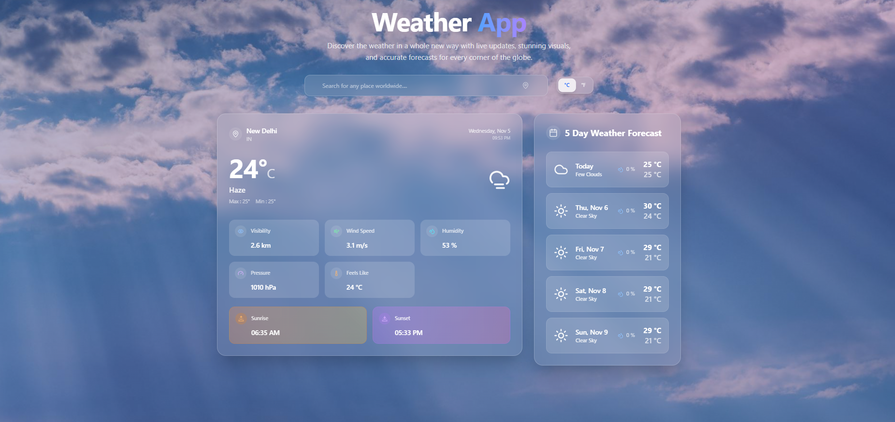

# 🌦️ Advanced Weather App

A modern, responsive **Weather App** built with **React + Vite**, powered by the **OpenWeather API**.  
This app provides real-time weather data, 5-day forecasts, auto-suggest search, temperature toggles, and detailed weather information for any location.  
It also includes a current location finder using browser geolocation.

---

## 🚀 Features

### 🔍 **Search & Suggestions**
- Search any city worldwide  
- Smart **auto-suggestions** while typing  

### 🌡️ **Temperature**
- Toggle between **°C / °F**  
- Shows current, max, and min temperatures  

### 📅 **5-Day Weather Forecast**
- Displays predictions for the next 5 days  
- Includes icons + temperature + conditions  

### 📊 **Detailed Weather Info**
- Feels like  
- Humidity (%)  
- Pressure (hPa)  
- Visibility (meters)  
- Wind speed  
- Sunrise & Sunset (converted to local time)  

### 📍 **Current Location Weather**
- Detects your location using browser geolocation  
- Auto-fetches weather for your city  

### ⏳ **Loading State**
- Smooth loading spinner when fetching data  

### ❌ **Error Handling**
- Handles invalid city names  
- Handles API errors gracefully  

---

## 🛠️ Tech Stack

- **React** (component-based UI)
- **Vite** (fast bundler + dev server)
- **OpenWeather API**
- **CSS**
- **Geolocation API**

---

## 📸 Screenshot

